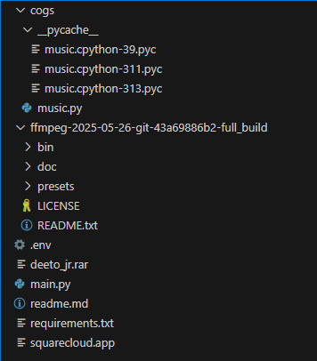

## BOT DE MUSICA (para discord)

### estrutura do projeto:

📁 BOT

/

├── 📁 cogs

    ├── 📁 _pycache_

        ├── music.cpython-39.pyc

        ├── music.cpython-311.pyc

        └── music.cpython-313.pyc

    └── music.py

├── 📁 ffmpeg

├── .env

├── main.py

├── requirements.txt

└── squarecloud.app

### Sobre o arquivo .env

você deve colar o token e o id do seu bot

### Sobre a pasta ffmpeg (windows)

em requirements.txt temos as dependencias a serem instaladas, a ultima, ffmpeg, voce também deve instalar em https://ffmpeg.org/  -> Windows builds from gyan.dev  ->  ffmpeg-git-full.7z

adicionar nas variaveis de ambiente (path) o caminho da ./bin

#créditos:

https://www.youtube.com/@DuneDiscord?sub_confirmation=1
